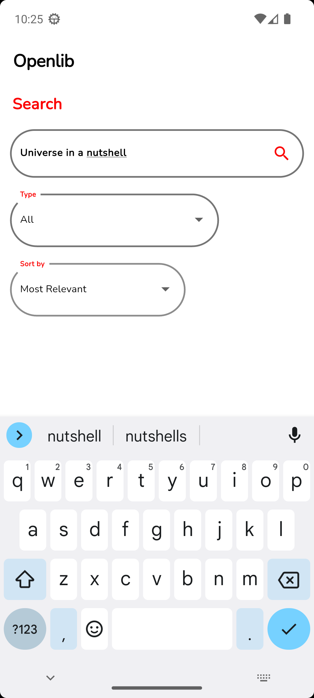
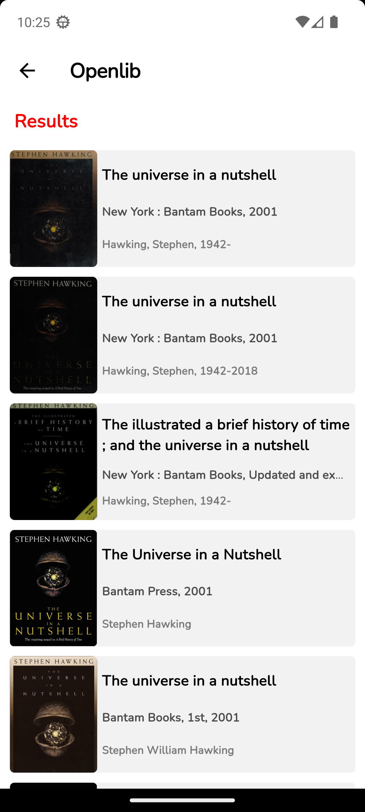
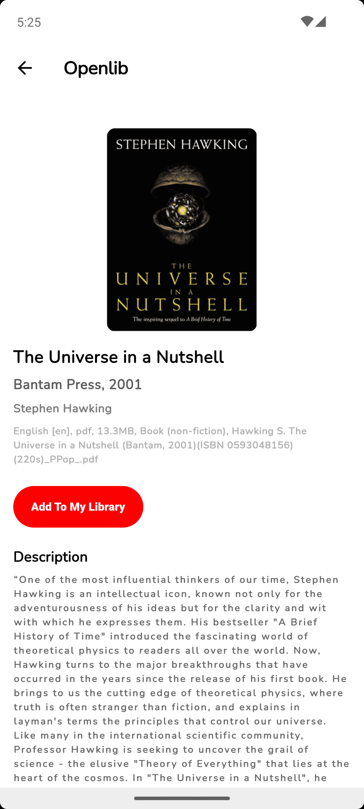
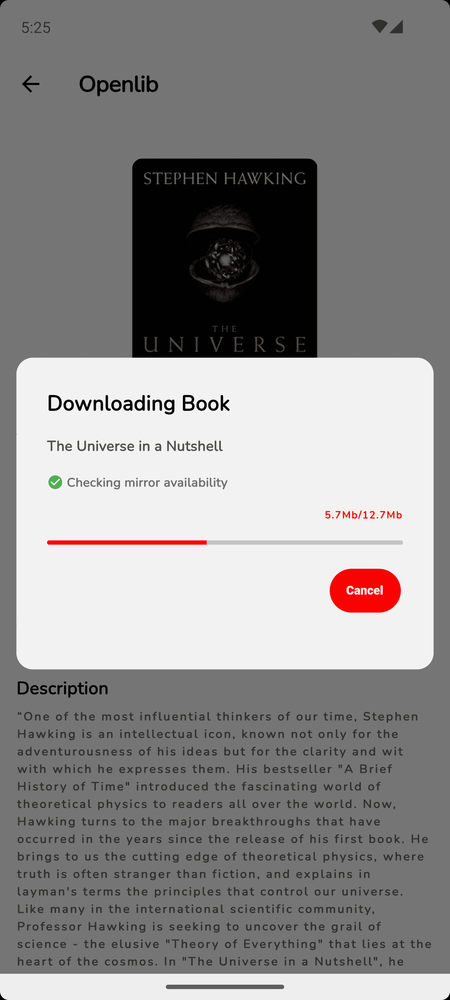
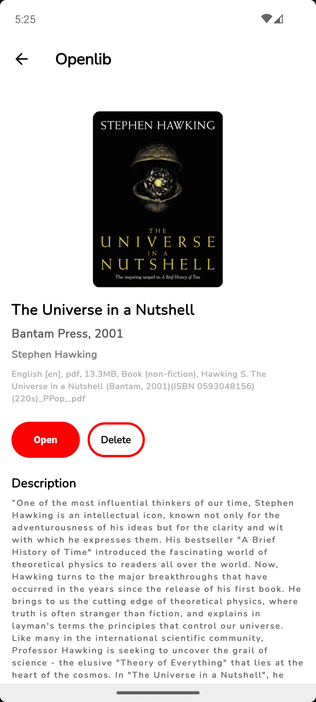
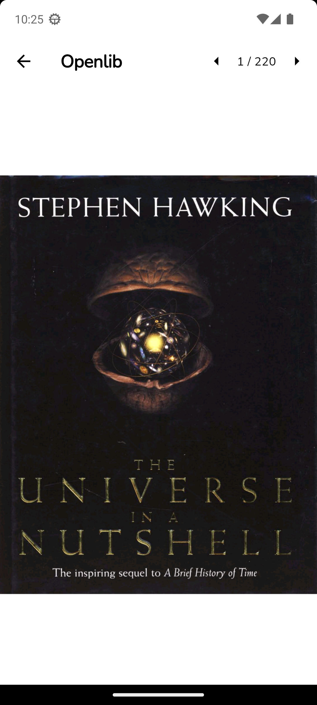

<div align="center">


# Openlib

#### An open-source app to download and read books from shadow library ([Anna’s Archive](https://annas-archive.org/)).

[](https://flutter.dev/)
[](https://opensource.org/licenses/)
[](https://github.com/dstark5/Openlib/releases)

[](https://github.com/dstark5/Openlib/releases)
[](https://android.izzysoft.de/repo/apk/com.app.openlib)
[](https://f-droid.org/en/packages/com.app.openlib/)

</div>

## Note 📝

**WARNING:** This app is in beta stage, so you may encounter bugs. If you do, open an issue in the GitHub repository.

#### Publishing Openlib, or any fork of it in the Google Play Store violates their terms and conditions.

## Screenshots 🖼️

[](screenshots/Screenshot_1.png)
[](screenshots/Screenshot_2.png)
[](screenshots/Screenshot_3.png)
[](screenshots/Screenshot_4.png)
[](screenshots/Screenshot_5.png)
[](screenshots/Screenshot_6.png)
[](screenshots/Screenshot_7.png)
[](screenshots/Screenshot_8.png)

## Description 📖

##### Openlib is an open-source app to download and read books from shadow library ([Anna’s Archive](https://annas-archive.org)). The app has a built-in reader to read books.

##### As [Anna’s Archive](https://annas-archive.org) doesn't have an API, the app works by sending requests to Anna’s Archive and parsing the response to objects. The app extracts the mirrors from response and downloads the book.

## Features ✨

- Trending books
- Download and read books with built-in viewer
- Supports Epub and PDF formats
- Open books in your favorite ebook reader
- Filter books
- Sort books

## Roadmap 🎯

- Adding more book format supports (cbz, cbr, azw3, etc...)
- Adding support for background downloads
- Adding support for multiple downloads

## Building from source

- If you don't have Flutter SDK installed, please visit the official [Flutter](https://flutter.dev) site.

- Git clone the repository

```
git clone https://github.com/dstark5/Openlib.git
```

- Run the app with Android Studio or VS Code, or the command line:

```
flutter pub get
flutter run
```

- To build the app, run:

```
flutter build
```

- The build will be in './build/app/outputs/flutter-apk/app-release.apk'

## Contributor required 🚧

We're actively seeking contributors. Whether you're a seasoned developer or just starting out, we welcome your
contributions to help make this project even better!

## Contribution 💝

Whether you have ideas, design changes or even major code changes, help is always welcome. The app gets better and
better with each contribution, no matter how big or small!

If you would like to get involved, see [CONTRIBUTING.md](./CONTRIBUTING.md) for the guidelines.

## Issues 🚩

Please report bugs via the [issue tracker](https://github.com/dstark5/Openlib/issues).

## Donate 🎁

If you like Openlib, you're welcome to send a donation.

#### [Donate to Anna’s Archive.](https://annas-archive.org/donate?tier=1)

## License 📜

[](https://www.gnu.org/licenses/gpl-3.0.en.html)

Openlib is a free software licensed under GPL v3.0. It is distributed in the hope that it will be useful, but WITHOUT
ANY
WARRANTY. [GNU General Public License](https://www.gnu.org/licenses/gpl.html) as published by the Free Software
Foundation, either version 3 of the license, or (at your option) any later version.

## Disclaimer ⚠️

Openlib doesn't own or have any affiliation with the books available through the app. All books are the property of
their respective owners and are protected by copyright law. Openlib is not responsible for any infringement of copyright
or other intellectual property rights that may result from the use of the books available through the app. By using the
app, you agree to use the books only for personal, non-commercial purposes and in compliance with all applicable laws
and regulations.
